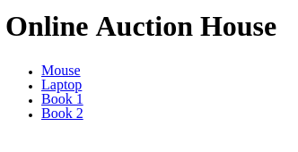
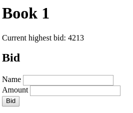
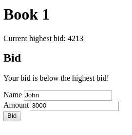

# Backend Auction exam

We are going to create a web-based auction application.

## Highlights

### It has two frontend pages which can:

- list not expired auction items
- save new bid to an auction item

### It has a backend which can:

- save new bid based on form data
- save new bid based on json data
- list all/filtered auction items with their bids
- update a bid
- delete expired auction items

## Database

There are two tables, one is `auction_item` and another is `bid`.
In this application, `bid` can be assigned only to one `auction_item`, but `auction_item` can
have more `bid`s.

- auction_item:
    - id, name, expire_date

- bid:
    - id, bidder_name, amount, auction_item_id

Example database: [auction.sql](assets/backend-auction.sql)

## Endpoints

Create the following endpoints:

## GET `/`


- The main page should be rendered
- It must contain a list with the not expired auction items
- Each auction must be linked to the auction's bidding page (GET `/auction/{id}`)

## GET `/auction-items/{id}` (get an auction item and give some info)

- The bidding page should be rendered to the specific auction
- The current highest bid should be displayed
- Display a form with two input fields and a submit button
- The form should be submitted to `POST /bid`
- The form should send the following data to `POST /bid`:
    - bidderName
    - amount
    - auctionItemId
- Display a descriptive message if the auction item is not found
- Display the message if it gets a message (check `POST /bid` description)

### The auction's bidding page has 2 scenarios

#### 1. Normal



----------------

#### 2. Message



## POST `/bid`

- It should save a new bid for the given auction based on the following form POST data:
    - bidderName
    - amount
    - auctionItemId
- When the bid `amount` is less than or equal to the highest bid's amount then redirect to the
  GET `/auction/{id}` endpoint with the error message:
  "Your bid is below the highest bid!"
    - Do not clear the input fields
- When the auction is over redirect to GET `/auction/{id}` endpoint with the following error message:
  "The auction is over!"
- When all data is fine then redirect to
  the GET `/auction/{id}` endpoint with the following message: "Your bid is accepted!"
- Always display an error message in the case of error. The error message should be descriptive
  enough to understand what went wrong.

## POST `/api/bid`

- It should save a new bid based on the following JSON format

```json
{
  "bidderName": "John",
  "amount": 21344,
  "auctionItemId": 3
}
```

- When the bid `amount` is less than or equal to the highest bid's amount then it should respond
  with the following JSON format with status `400`:

```json
{
  "message": "Your bid is below the highest bid!"
}
```

- When the auction is over it should respond
  with the following JSON format with status `400`:

```json
{
  "message": "The auction is over!"
}
```

- When auction is not found it should respond
  with the following JSON format with status `404`:

```json
{
  "message": "Auction not found!"
}
```

- In the case of success it should respond with the following JSON format with status `201`:

```json
{
  "bidId": 15,
  "bidderName": "John",
  "amount": 21344,
  "auctionItemId": 3
}
```

## PATCH `/api/bid/{id}`

- It should update the given bid's amount based on the following JSON format

```json
{
  "amount": 21344
}
```

- It should update only the given bid's amount (by id)
- When the bid `amount` is less than or equal to the highest bid's amount then it should respond
  with the following JSON format with status `400`:

```json
{
  "message": "Your bid is below the highest bid!"
}
```

- When the auction is over it should respond
  with the following JSON format with status `400`:

```json
{
  "message": "The auction is over!"
}
```

- When all data is fine then it should respond with the following JSON format with status `200`:

```json
{
  "bidId": 15,
  "bidderName": "John",
  "amount": 21344,
  "auctionItemId": 3
}
```

## DELETE `/api/auction-items`

- It should delete all expired auction items
- It should respond with the following JSON format with status `200`:

```json
{
  "message": "Expired auction items are deleted!"
}
```

## GET `/api/auction-items`

- When the `expired=true` query parameter is given then it should respond
  with the expired auction items
- When the `expired=false` query parameter is given then it should respond
  with the not expired auction items
- When the `expired` query parameter is not given then it should respond
  with all auction items

- It should respond with the stored auction items in the following JSON format

- The `expireDate`'s format might be different but must include the year, month,
  day, hour, minute, and second

```json
[
  {
    "id": 3,
    "title": "Book 2",
    "expireDate": "2018-03-04T23:12:123",
    "bids": [
      {
        "name": "John",
        "amount": 21344
      },
      {
        "name": "Jane",
        "amount": 321
      },
      {
        "name": "Doe",
        "amount": 73
      }
    ]
  }
]
```
